## 使い方

#### 1. 「LotteryCheckToolMaker.exe」を起動する

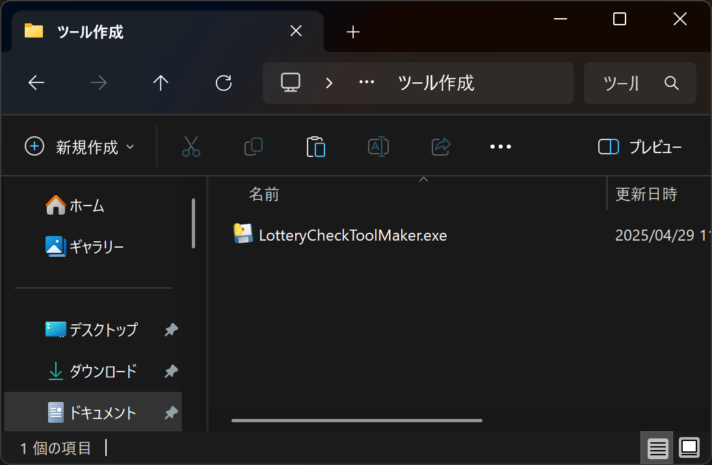
「LotteryCheckToolMaker.exe」をダブルクリックすることで起動します。
インストール不要です。
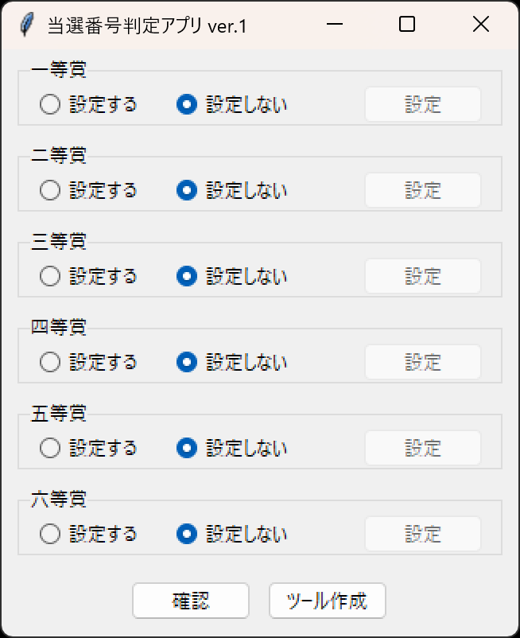

#### 2. 「設定する」を選択する

一等賞から六等賞まで設定可能です。
デフォルトではすべての等賞に「設定しない」が選択されています。
設定したい等賞を「設定する」に変更します。
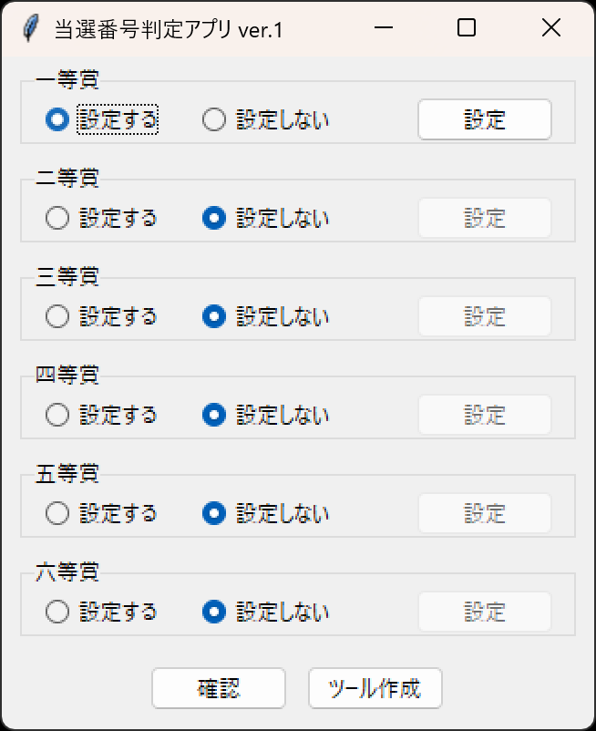

#### 3. 設定ボタンを押下する

「設定する」に変更した等賞について、設定ボタンが押下できるようになります。
一等賞の設定ボタンを押下すると、以下の通り設定画面が表示されます。
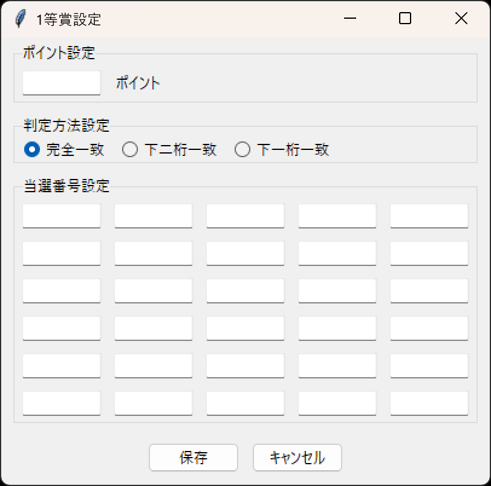

#### 4. ポイント・判定方法・当選番号を設定する

ポイント・判定方法・当選番号をそれぞれ設定します。
その上で保存ボタンを押下すると、設定が保存され設定画面が閉じます。
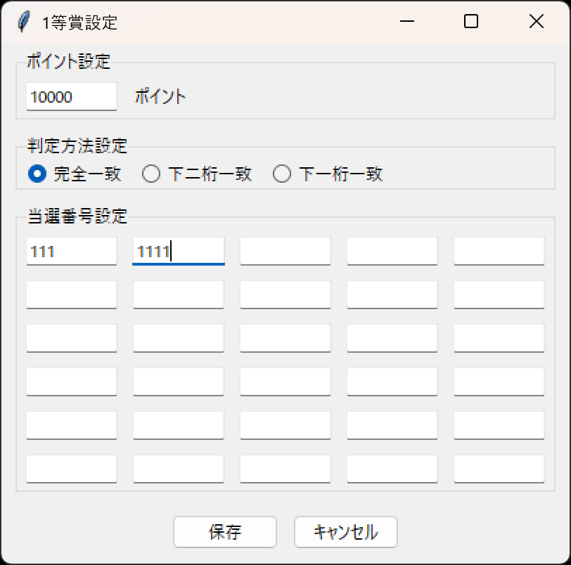
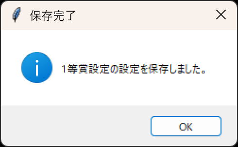

設定が完了した等賞に、「設定済み」と表示されます。
再度設定ボタンを押下することで、再設定が可能です。
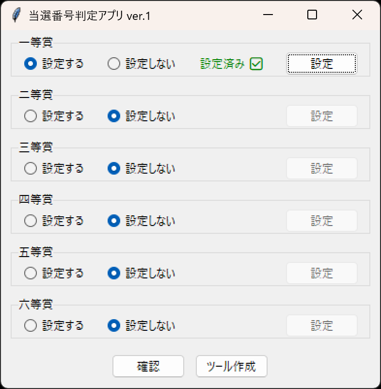

二等賞及び三等賞についても以下の通り設定します。
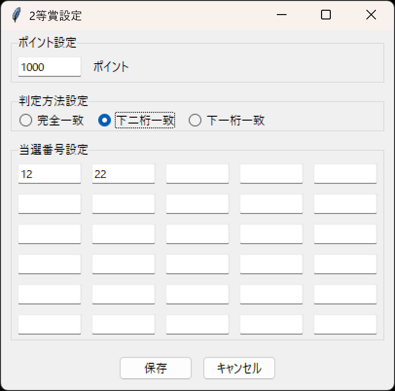
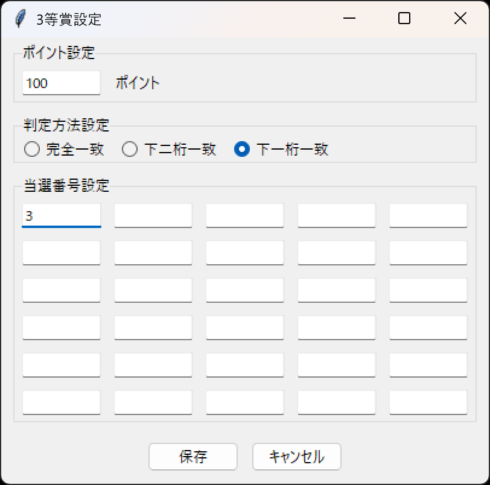

一等賞から三等賞まで設定済みになりました。
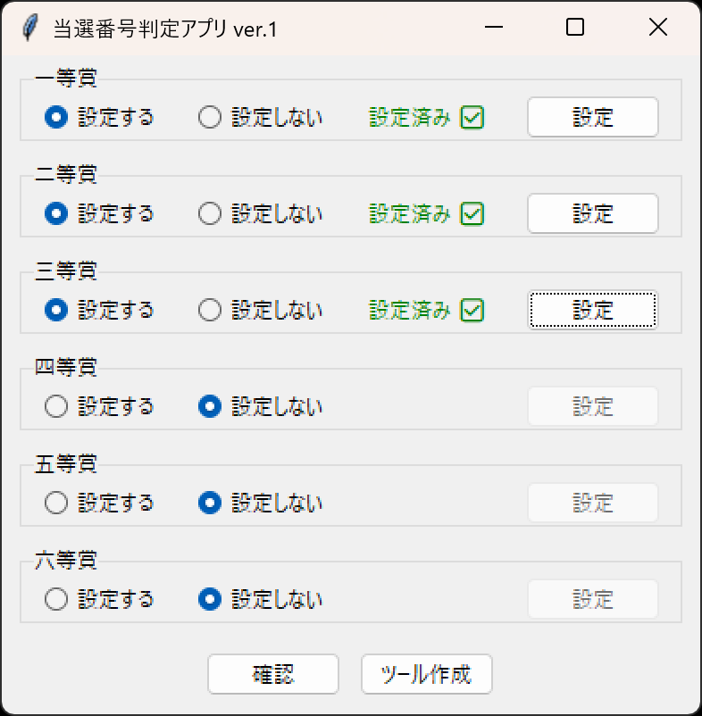

#### 5. 設定を確認する

設定した内容に誤りがないか確認します。
確認ボタンを押下することで、設定確認画面が表示されます。
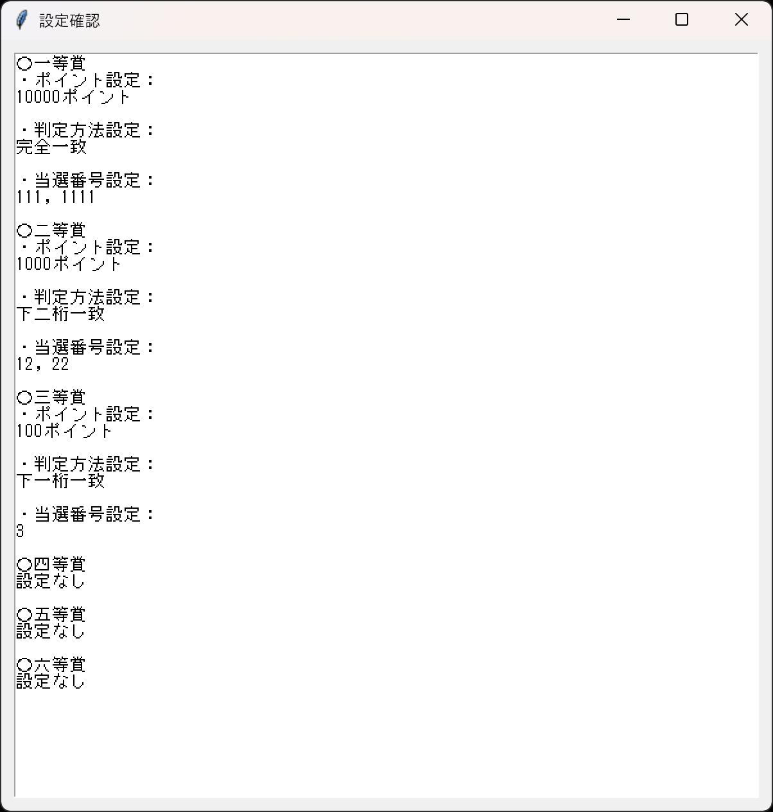

#### 6. ツールを作成する

ツール作成ボタンを押下することで、「LotteryCheck.bat」ファイルの保存が表示されます。
任意のファイル名およびフォルダを設定し、保存します。
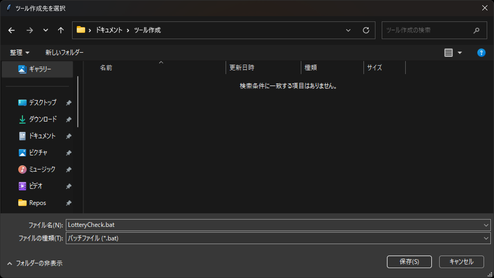

#### 7. ツールを起動する

保存したツール（ここでは「LotteryCheck.bat」）をダブルクリックします。
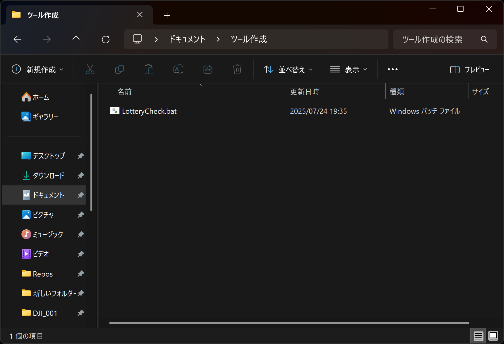

ツールが起動されます。
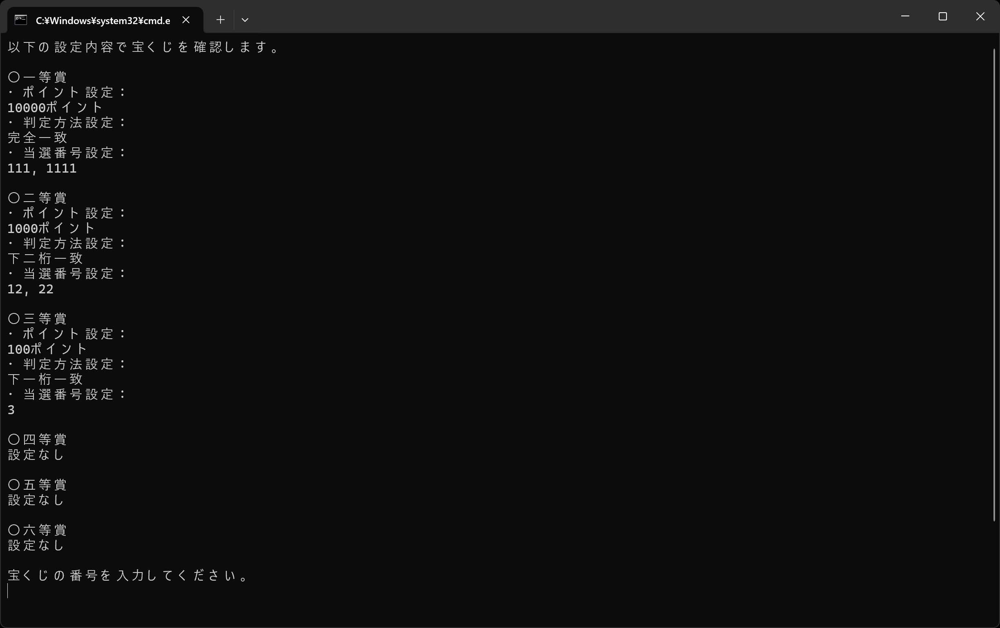

111や1111を入力しエンターを押下すると、一等賞と判定されます。
下二桁が12または22の場合は二等賞と判定されます。
下一桁が3の場合は三等賞と判定されます。
不正な入力の場合はERRORが表示されます。（全角数字もエラーとなります。）
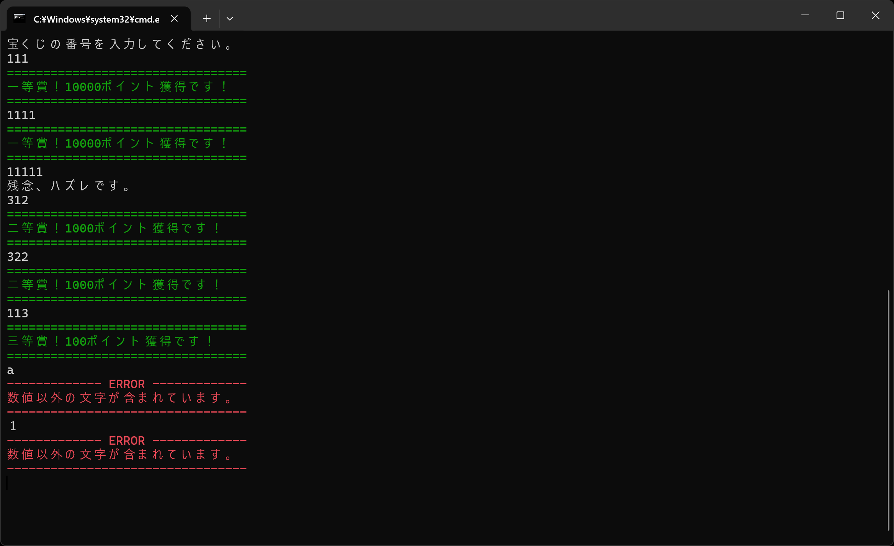